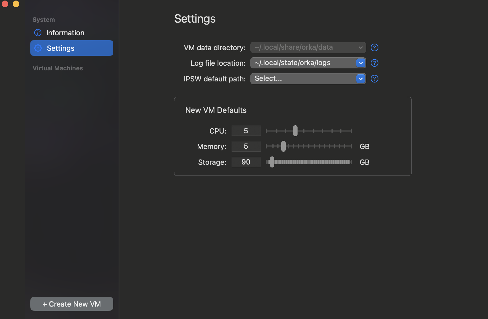
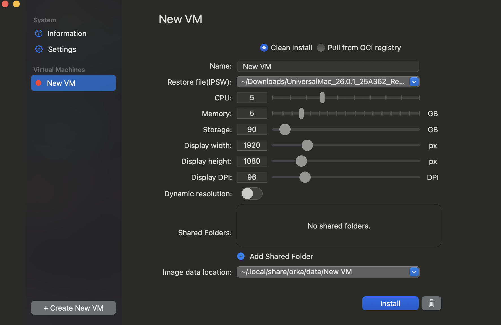
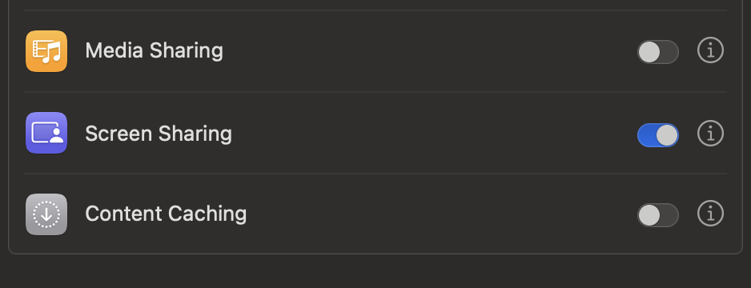
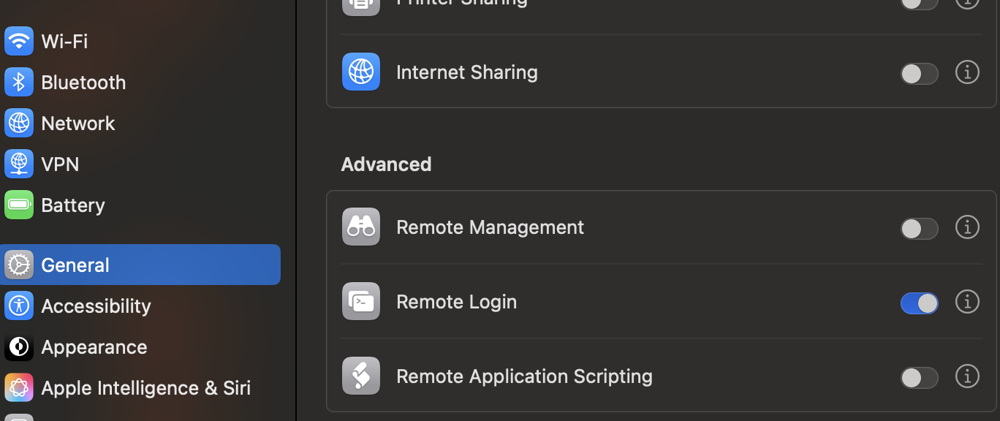
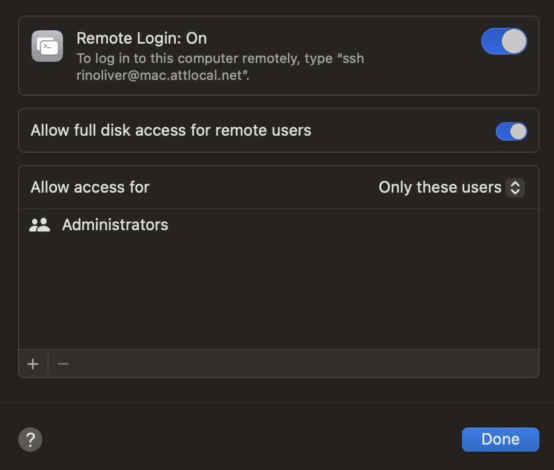

# Orka VM Setup Script Usage

## This script automates a portion of the configuration and setup of macOS Orka VMs for optimal performance. It installs required tools, preparing the VM for use with Orka

### System requirements

- Orka Desktop [v3.1.0](https://github.com/macstadium/orka-desktop/releases/tag/3.1.0)
- macOS IPSW file (Tahoe, Sequoia, or Sonoma)
- Internet connection for downloading packages
- Terminal access (via SSH, Screen Sharing, or direct console)

### Before running the script

- Open Orka Desktop and select 'Create new VM'



- Select 'Other' from the 'Restore file (IPSW)' option in the GUI and click on your chosen IPSW file


- Click 'Install' and wait for the IPSW installation process to complete



- Start your VM by clicking 'Start'. You will need to go through the initial MacOS setup steps such as setting a language, Filevault permissions, location sharing, timezone, etc.

- Once you have completed the initial MacOS setup and are successfully logged into your VM, Toggle 'Screen Sharing' on via the GUI **System Preferences -> General -> Sharing -> Screen Sharing** so that system settings persist when connecting to a VM via SSH.



- Toggle 'Remote Login' on via the GUI  **System Preferences -> General -> Sharing -> Remote Login**



- Enable 'Full Disk Access' to SSH via the GUI **System Settings -> General -> Sharing**. This should also automatically enable Full Disk Access for remote users by default when this option is selected. If 'Allow Full Disk Access' is for any reason not enabled, you will want to do so by clicking the ⓘ icon next to "Remote Login", and selecting 'Allow full disk access for remote users'.



- Save any work in progress
- Close all open applications manually
- Empty the Trash if desired

### Installation

#### Download via GitHub

```bash
/bin/bash -c "$(curl -fsSL https://raw.githubusercontent.com/macstadium/orka-images/HEAD/setup/setup.sh)"
```

### Installation steps when running the script

- Make the script executable if you have downloaded it directly by entering: `chmod +x /Users/<username>/<folder>/setup.sh` in the Terminal
- Select 'Accept' when prompted by the Terminal application to begin running the script
- Enter your password when prompted during the script installation process step that installs the Orka VM tools
- Close and re-open the Terminal application
- Enter `sudo launchctl list sysctl` and input your password when prompted. This step is optional, but useful to confirm the Orka sys-daemon script has installed successfully. You should see an output similar to:

```markdown
"LimitLoadToSessionType" = "System";
"Label" = "sysctl";
"OnDemand" = true;
"LastExitStatus" = 0;
"Program" = "/usr/sbin/sysctl";
"ProgramArguments" = (
"/usr/sbin/sysctl";
"-w";
"net.link.generic.system.hwcksum_tx=0";
"net.link.generic.system.hwcksum_rx=0";
"net.inet.tcp.tso=0"; );
```

### What the script does

#### Tool installation

- Downloads and installs the current version of Orka VM Tools, default is v3.5.0
- Downloads and runs Orka `sys-daemon.sh` setup script (this is used to optimize the Screen Share and VNC performance of the VM)

The following cannot be automated due to macOS security requirements (TCC permissions) and must be configured manually via System Settings:

- Screen Sharing: Must be enabled via GUI to initialize TCC database permissions
- Remote Login (SSH): Should be enabled via GUI alongside Screen Sharing
- Full Disk Access: Must be granted for SSH connection via remote login
